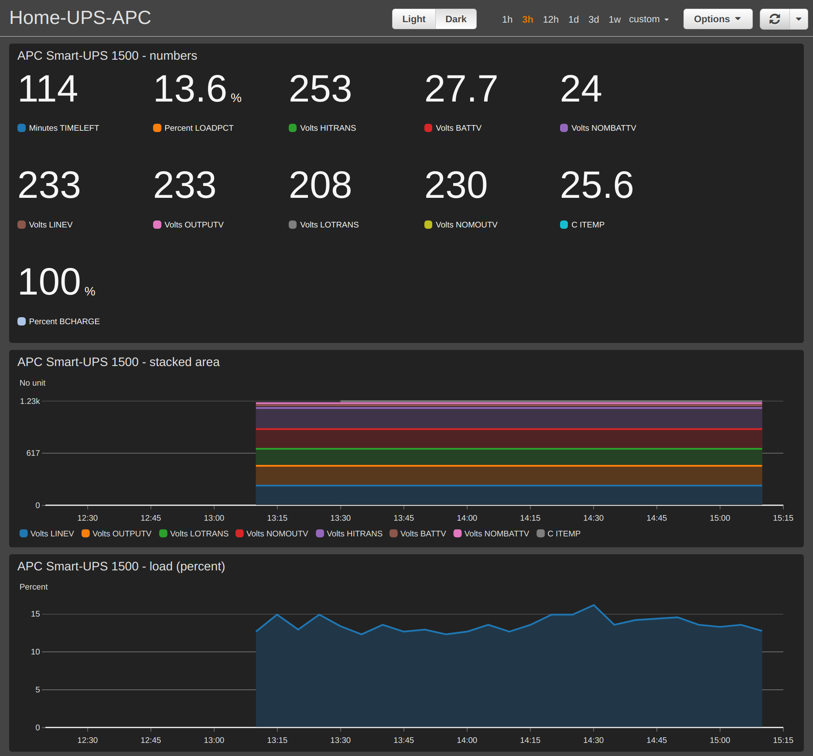

# apcmetrics2cloudwatch
## About
Script for publishing APC UPS (apcupsd) metrics into AWS CloudWatch Metrics. You can create and publish AWS CloudWatch Dashboard. See [live example](https://cloudwatch.amazonaws.com/dashboard.html?dashboard=Home-UPS-APC&context=eyJSIjoidXMtZWFzdC0xIiwiRCI6ImN3LWRiLTcxMDM5ODUwNDIwOSIsIlUiOiJ1cy1lYXN0LTFfYXcxb0JtODdUIiwiQyI6Im90Y3FuaDEybHYwbWhmbGVzamJocm04azUiLCJJIjoidXMtZWFzdC0xOjg4YmY2ODBiLWYxMTQtNDVjOS05YzlkLTE4OTUzZTdlNDIxMSIsIk0iOiJQdWJsaWMifQ%3D%3D).


## Installation on Ubuntu Linux
* Install apcupsd package:
```
sudo apt-get install apcupsd
```
* Configure apcupsd:
```
sudo echo "ISCONFIGURED=yes" >> /etc/default/apcupsd
```
```
sudo echo "
UPSNAME homeups1
UPSCABLE usb
UPSTYPE usb
DEVICE" >> /etc/apcupsd/apcupsd.conf
```
* Test connection with apctest:
```
$ apctest

2020-10-24 14:01:56 apctest 3.14.14 (31 May 2016) debian
Checking configuration ...
sharenet.type = Network & ShareUPS Disabled
cable.type = USB Cable
mode.type = USB UPS Driver
Setting up the port ...
Doing prep_device() ...

You are using a USB cable type, so I'm entering USB test mode
Hello, this is the apcupsd Cable Test program.
This part of apctest is for testing USB UPSes.

Getting UPS capabilities...SUCCESS

Please select the function you want to perform.

1)  Test kill UPS power
2)  Perform self-test
3)  Read last self-test result
4)  View/Change battery date
5)  View manufacturing date
6)  View/Change alarm behavior
7)  View/Change sensitivity
8)  View/Change low transfer voltage
9)  View/Change high transfer voltage
10) Perform battery calibration
11) Test alarm
12) View/Change self-test interval
 Q) Quit

Select function number:
```
* Enable and start apcupsd as a system service:
```
sudo systemctl daemon-reload
sudo systemctl enable apcupsd
sudo systemctl start apcupsd
sudo systemctl status apcupsd

● apcupsd.service - UPS power management daemon
     Loaded: loaded (/lib/systemd/system/apcupsd.service; enabled; vendor preset: enabled)
     Active: active (running) since Sat 2020-10-24 14:03:38 CEST; 6min ago
       Docs: man:apcupsd(8)
    Process: 34688 ExecStartPre=/lib/apcupsd/prestart (code=exited, status=0/SUCCESS)
    Process: 34707 ExecStart=/sbin/apcupsd (code=exited, status=0/SUCCESS)
   Main PID: 34708 (apcupsd)
      Tasks: 3 (limit: 38392)
     Memory: 1.1M
     CGroup: /system.slice/apcupsd.service
             └─34708 /sbin/apcupsd

paź 24 14:03:38 michal-Z390 systemd[1]: Starting UPS power management daemon...
paź 24 14:03:38 michal-Z390 systemd[1]: apcupsd.service: Can't open PID file /run/apcupsd.pid (yet?) after start: Operation not permitted
paź 24 14:03:38 michal-Z390 apcupsd[34708]: apcupsd 3.14.14 (31 May 2016) debian startup succeeded
paź 24 14:03:38 michal-Z390 systemd[1]: Started UPS power management daemon.
paź 24 14:03:39 michal-Z390 apcupsd[34708]: NIS server startup succeeded
```
* Test apcupsd service with apcaccess:
```
$ apcaccess

APC      : 001,043,1020
DATE     : 2020-10-24 14:35:59 +0200
HOSTNAME : michal-Z390
VERSION  : 3.14.14 (31 May 2016) debian
UPSNAME  : homeups1
CABLE    : USB Cable
DRIVER   : USB UPS Driver
UPSMODE  : Stand Alone
STARTTIME: 2020-10-24 14:03:38 +0200
MODEL    : Smart-UPS 1500
STATUS   : ONLINE
LINEV    : 233.2 Volts
LOADPCT  : 12.3 Percent
BCHARGE  : 100.0 Percent
TIMELEFT : 114.0 Minutes
MBATTCHG : 10 Percent
MINTIMEL : 3 Minutes
MAXTIME  : 0 Seconds
OUTPUTV  : 233.2 Volts
SENSE    : High
DWAKE    : -1 Seconds
DSHUTD   : 90 Seconds
LOTRANS  : 208.0 Volts
HITRANS  : 253.0 Volts
RETPCT   : 0.0 Percent
ITEMP    : 25.6 C
ALARMDEL : 30 Seconds
BATTV    : 27.7 Volts
LINEFREQ : 50.0 Hz
LASTXFER : Automatic or explicit self test
NUMXFERS : 0
TONBATT  : 0 Seconds
CUMONBATT: 0 Seconds
XOFFBATT : N/A
SELFTEST : NO
STESTI   : 14 days
STATFLAG : 0x05000008
MANDATE  : 2009-03-24
SERIALNO : AS0913220780
BATTDATE : 2020-10-24
NOMOUTV  : 230 Volts
NOMBATTV : 24.0 Volts
FIRMWARE : 653.18.I USB FW:7.3
END APC  : 2020-10-24 14:36:02 +0200
```
* Open **upsmetrics.service.example** file in the editor and set correct path to **put_metrics.py** script
* Copy new service configuration file for systemd:
```
sudo cp examples/upsmetrics.service /lib/systemd/system/upsmetrics.service
```
* Enable and start upsmetrics as a system service:
```
sudo systemctl daemon-reload
sudo systemctl enable upsmetrics
sudo systemctl start upsmetrics
sudo systemctl status upsmetrics

● upsmetrics.service - Put APC UPS metrics to AWS CloudWatch
     Loaded: loaded (/lib/systemd/system/upsmetrics.service; enabled; vendor preset: enabled)
     Active: active (running) since Sat 2020-10-24 14:10:32 CEST; 4s ago
   Main PID: 35274 (python3)
      Tasks: 1 (limit: 38392)
     Memory: 20.4M
     CGroup: /system.slice/upsmetrics.service
             └─35274 /usr/bin/python3 /home/michal/Documents/upsmetrics/main.py

paź 24 14:10:32 michal-Z390 systemd[1]: Started Put APC UPS metrics to AWS CloudWatch.
```
## AWS Credentials
Put AWS Credentials under "cloudwatch" profile into *.aws/credentials* file located in the home directory of the service user.
Make sure the associated policy allows only for PutMetricData operation.